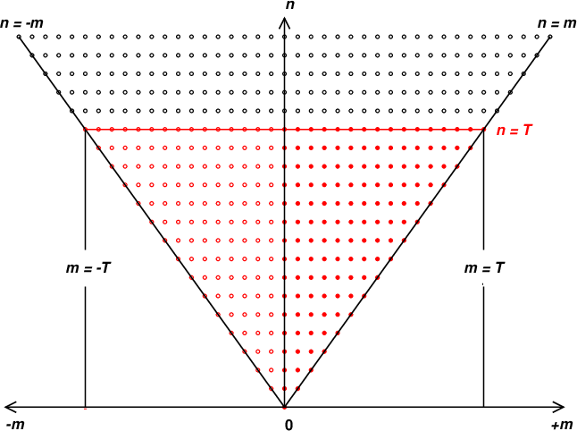

# Spherical Harmonics

Let $\theta$ denote the meridional angle, and $\phi$ represent the zonal angle. For an atmospheric quantity $A(\lambda, \mu, \eta, t)$, where $\lambda$ is longitude and $\mu$ is latitude (following Fortran-style ordering), the corresponding truncated spherical harmonic series is given by:

$$
\sum_{m=-T}^T \sum_{n=|m|}^T X(m,n)(\eta, t) \bar{P}_n^m(\mu) e^{im\lambda},
$$

where $\bar{P}_n^m$ is the Legendre polynomial normalized such that $\int_{-1}^1 \bar{P}^{m}_n(x)^2 \, dx = 2$.

Note that the origin corresponds to a pole.

### Checkpoint:
- [ ] There are two poles in the globe, but only one origin in this figure.